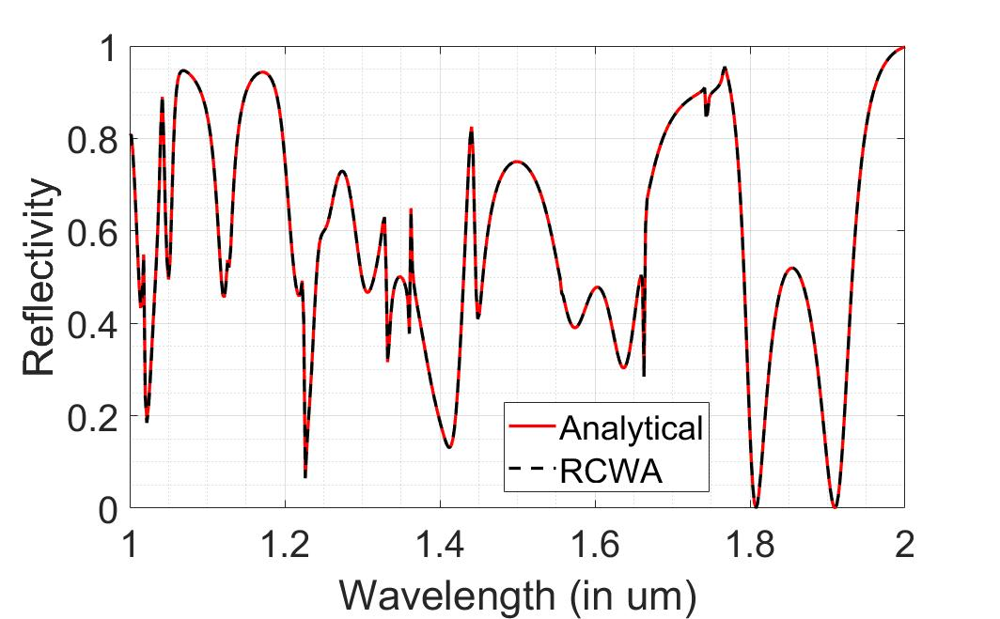
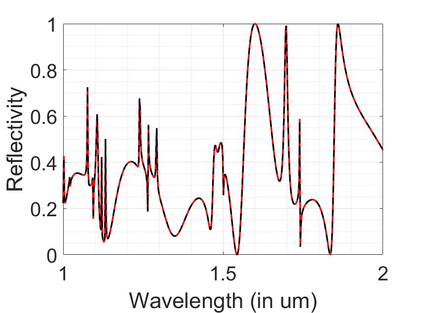
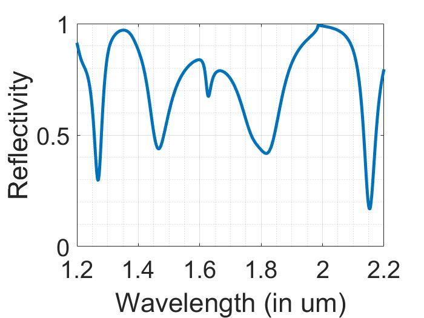
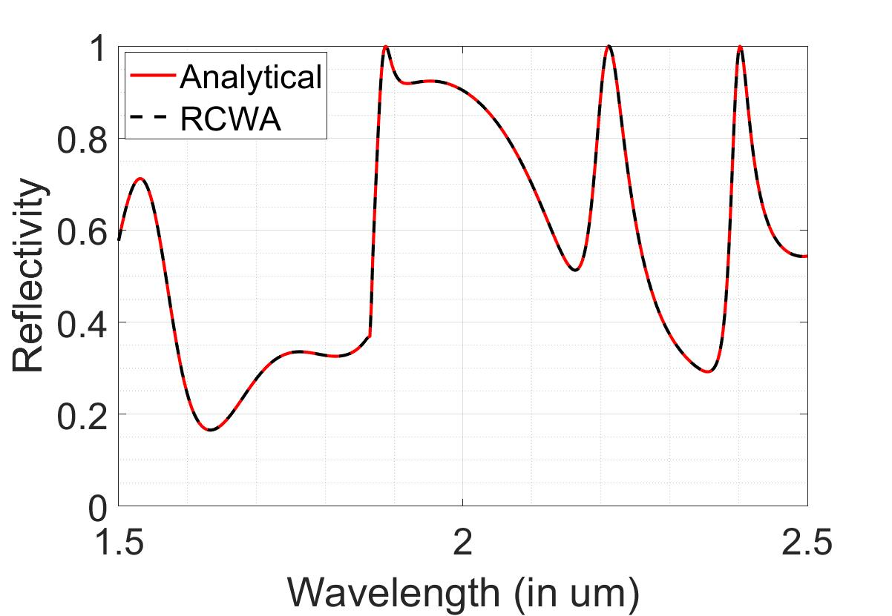
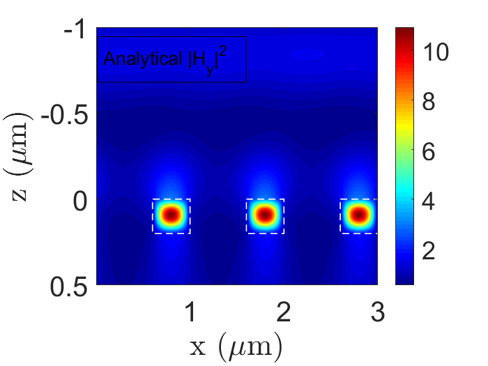
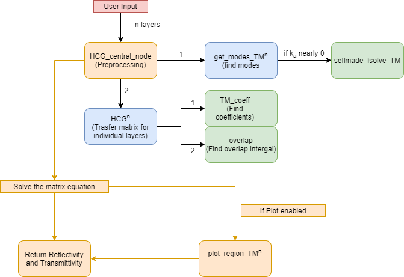

# Grating Analysis Code

This repository hosts the code for analysis of the some electromagnetic properties of Grating structures.

A grating waveguide is an optical waveguide where the waveguide is in form of periodic structures (1-D or 2-D), more can be read on wikipedia <a href="https://en.wikipedia.org/wiki/High_contrast_grating">here</a>. This is how our structure looks like:

The period of grating is denoted by &Lambda;,&theta; is the angle of incidence k0 denotes the wavevector of incident wave, we take surrounding medium to be air, so that n0=1, we assume translational symmetry in y-axis so that &phi;=0, nbar is the refractive index of bar, we assume that all refractive indices are real. Polarization can be TM or TE. Another variable needed is the duty cycle, or the fraction of space in each period of grating occupied by the bar, we denote this by &eta;.
All these variables describe the required physics needed to model the device.

Our interest lies in computing the reflectivity and the transmittivity exhibited by the structure for given values of (&Lambda;,k0,&theta;,nbar, &eta;). The reflected and transmitted power will further be divided into amongst various diffracted beams.

We now show the results obtained by our code, then we shall explain how to use the code and then performance issues and limitations will be demonstrated.

<h3>Results</h3>

<h4>Reflectivity Spectrum </h4>
The reflectivity spectrum obtained using our code with RCWA results superimposed for Benchmarking.

|
TE mode
          | 
TM mode
|
|-------------------------|-------------------------|
|  |  |
|  |  |

<h4>Field intensity profile</h4>

|
TE mode
          | 
TM mode
|
|-------------------------|-------------------------|
|  |  |
|  |  |
|  |  |

<h3>Code</h3>
The main code is <strong>HCG_central_node</strong>. The various callee and caller functions are shown:
 

<h3>Performance and issues</h3>

| Functionality      | Results benchmarked? | Source for benchmarking|
| ----------- | ----------- | ---------|
|  TM mode reflectivity   | 
&#9745;
    | RCWA|    
|  TE mode reflectivity  | 
&#9745;
    |RCWA|
| TM mode field profile |   
&#9746;
    ||
| TE mode field profile| 
&#9745;
      |Compated with Results in <a href="https://www.osapublishing.org/aop/abstract.cfm?uri=aop-4-3-379">High-contrast gratings for integrated optoelectronics  Connie J. Chang-Hasnain and Weijian Yang
</a>|

<h3>References</h3>

* <a href="https://www.osapublishing.org/aop/abstract.cfm?uri=aop-4-3-379">High-contrast gratings for integrated optoelectronics  Connie J. Chang-Hasnain and Weijian Yang
</a>  This is the primary reference where the analytical derivation of the model is carried out.

* <a href="https://in.mathworks.com/matlabcentral/fileexchange/55401-ppml-periodically-patterned-multi-layer">PPML-Periodically Patterned Multi Layer, Simone Zanotto</a> 
